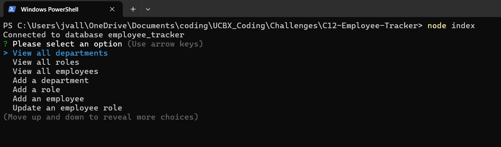

# C12-Employee-Tracker
This application creates simple Postgres database for tracking employees, their roles within a company, and the departments housing those roles. It uses nodejs package "inquirer" to read and respond to prompts in the terminal, executing appropriate psql queries from those prompts.

## Installation & Setup Instructions
Before beginning installation of this application, please confirm that you have [nodejs](https://nodejs.org/en) and [PostgreSQL](https://www.postgresql.org/download/) downloaded and operational on your computer. You will need to have your local postgres username and password ready during setup.
1. Create a local clone of this repository (repo)
2. Open a terminal and navigate to the root directory of the downloaded repo
3. Type `npm i` in the terminal and wait for the node modules to finish installing
4. Type `node index`. If this is your first time running the program, you will be prompted to enter your postgres username and password. Enter these credentials
5. If the credentials were entered successfully, the application should load. See [Usage Instructions](#usage-instructions) for details on how to use the application.

## Usage Instructions

### Main Menu
On startup you will be prompted with a series of options to select. This main menu allows for the querying of data within the database, as well as performing CRUD operations on tables within the database.

### Menu Options
Options from this menu perform the following functions:
* The "view all" options will display all data in the corresponding table of the database
* The "Add a(n)" and "Update an" options will lead to a follow-up prompt asking for information regarding the new record you would like to add/update, then inserts/updates the new data into the appropriate table of the database
* The "Exit" option will end the program

After any option other than "Exit" has been selected, you will be returned to this main menu of options.

### Video Demo

https://github.com/user-attachments/assets/104fbf6d-857c-4e50-bbfe-b6117c2c84e0

## Code References

Formatting data for psql insert
* Purpose: Format json data for a psql insert statement
* Source: https://stackoverflow.com/questions/34990186/how-do-i-properly-insert-multiple-rows-into-pg-with-node-postgres
* Place(s) used: `seeds.mjs`

Setting environmental variables
* Purpose: Allow this application to create a psql pool connection using credentials passed by the user on setup
* Source: https://www.youtube.com/watch?v=O4bNwkC1ZxA
https://stackoverflow.com/questions/10829433/how-can-i-set-an-environment-variable-in-node-js
* Place(s) used: `setup.js`

Render data as table in console
* Purpose: Display requested queried data to the user in a human-readable format
* Source: https://stackoverflow.com/questions/47228227/nodejs-how-to-display-table-structured-in-console
* Place(s) used: `answer-handler.mjs`

Fix __dirname after transition to module
* Purpose: Allow for dynamic setting of __dirname variable after transition from non-module to module setup of project. 
* Source: https://www.geeksforgeeks.org/how-to-fix-referenceerror-dirname-is-not-defined-in-es-module-scope-in-javascript/
* Place(s) used: `db-connector.js`

Concat arrays
* Purpose: Create a new array with all values from two source arrays
* Source: https://stackoverflow.com/questions/9650826/append-an-array-to-another-array-in-javascript
* Place(s) used: `answer-handler.mjs`

Concat columns in sql query
* Purpose: Return values from two or more columns as a single column value in a psql query
* Source: https://stackoverflow.com/questions/19942824/how-to-concatenate-columns-in-a-postgres-select
* Place(s) used: `answer-handler.mjs`
